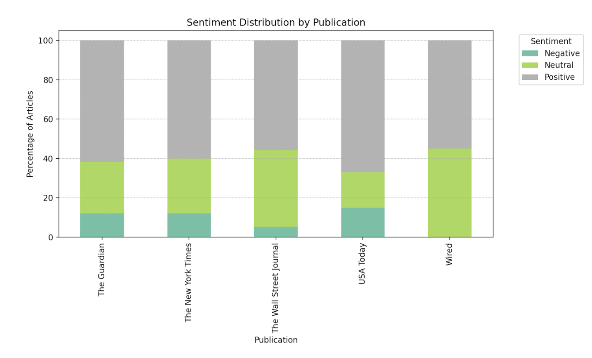

# AI‑Media‑Sentiment (2015 – 2024)
DistilBERT‑based sentiment analysis of 500 AI news articles

---

## Overview
This project fine‑tunes DistilBERT on 50 hand‑labeled articles, then scores
500 stories from **The NYT, WSJ, Wired, Guardian, and USA Today** to measure
how each outlet framed artificial intelligence over the past decade.

* 60 % Positive • 31 % Neutral • 9 % Negative
* All outlets trended toward neutrality after 2018.
* Tech/business outlets (Wired, WSJ) were consistently most optimistic.

---

## Key figures




*(Generate/refresh these with `scripts/plot_results.py`)*

Full report (PDF): **[docs/report.pdf](docs/report.pdf)**

---

## Repo layout

scripts/ one CLI per stage (clean, train, predict, evaluate, plot)
docs/ figures/ + report.pdf
requirements.txt
README.md

bash
Copy
Edit

Raw data, notebooks, and model files are excluded via `.gitignore`.

---

## Quick start

```bash
python3 -m venv .venv && source .venv/bin/activate
pip install -r requirements.txt

# clean -> train -> predict -> evaluate -> plot
python scripts/clean_data.py  --input data/data_1.csv --output data/data_clean_1.csv
python scripts/train_model.py --labeled data/labeled_data.csv --output models/distilbert_v1/
python scripts/predict.py     --model models/distilbert_v1/ --input data/unlabeled_data.csv --output data/sentiment_results.csv
python scripts/evaluate_model.py --labeled data/labeled_data.csv --scored data/sentiment_results.csv --out data/scored_with_predictions.csv --plot
python scripts/plot_results.py --csv data/scored_with_predictions.csv --kind rolling --window 14
Dependencies
Python 3.10 • PyTorch 2.x • Transformers ≥ 4.40 • pandas • scikit‑learn • matplotlib • ftfy

